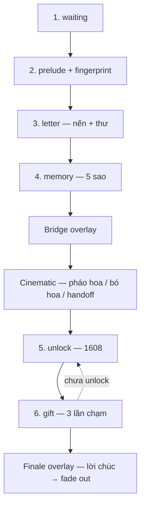

# Luồng trang quà sinh nhật (gift)

> **Đọc file này trước khi sửa logic hoặc thứ tự màn hình.**

## Tóm tắt

`waiting` → `prelude` → `letter` → `memory` → **bridge** → **cinematic** → `unlock` → `gift` → **finale (END)**

## Sơ đồ

## Chi tiết từng bước

| Bước | Key | HTML id | Kích hoạt |
|------|-----|---------|-----------|
| 1 | `waiting` | `waitingScreen` | `start()` |
| 2 | `prelude` | `preludeScreen` | countdown = 0 → `runPrelude()` |
| 3 | `letter` | `letterScreen` | fingerprint → `completeHold()` |
| 4 | `memory` | `memoryScreen` | `#continueButton` — gom 5 lời ước |
| 4b | overlay | `#sceneTransition` | `#memoryNextButton` (5 sao) |
| 4c | overlay | `#giftCinematic` | `playGiftGivingCinematic()` |
| 5 | `unlock` | `unlockScreen` | handoff tap → `playGiftHandoffReveal()` |
| 6 | `gift` | `giftScreen` | `verifyPasscode()` đúng `1608` |
| END | overlay | `#giftFinaleOverlay` | gift mở (bước 3) → `playGiftFinale()` |

## Hằng số

| Biến | Giá trị |
|------|---------|
| `PASSWORD` | `1608` |
| `DEFAULT_MONTH` | `7` (tháng 8) |
| `DEFAULT_DAY` | `16` |
| `RECIPIENT_NAME` | `Ánh` |

## Text sources

| Phần | Nơi sửa |
|------|---------|
| Prelude | `#preludeLines` trong `index.html` |
| Thư | `originalLetterParagraphs` trong `captureLetterHTML()` |
| 5 sao | `starTexts` — Sức khỏe, Niềm vui, Bình yên, May mắn, Hạnh phúc |
| Bridge | `#bridgeLines` trong `index.html` |
| Cinematic caption | `.bouquet-caption` trong `index.html` |
| Lời chúc cuối | `#giftBlessingLines`, `#giftEndingLines` |
| Waiting theme | `themes`, `getDailyHint` |

## Không có

- Success screen / MoMo / QR / polaroid / keepsake download / restart sau finale

## File map

| File | Vai trò |
|------|---------|
| `index.html` | Screens + overlays |
| `script.js` | Logic + `playGiftFinale()` |
| `styles.css` | Giao diện |
